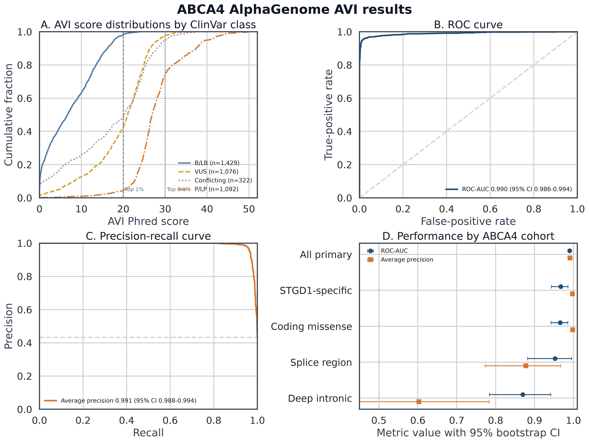
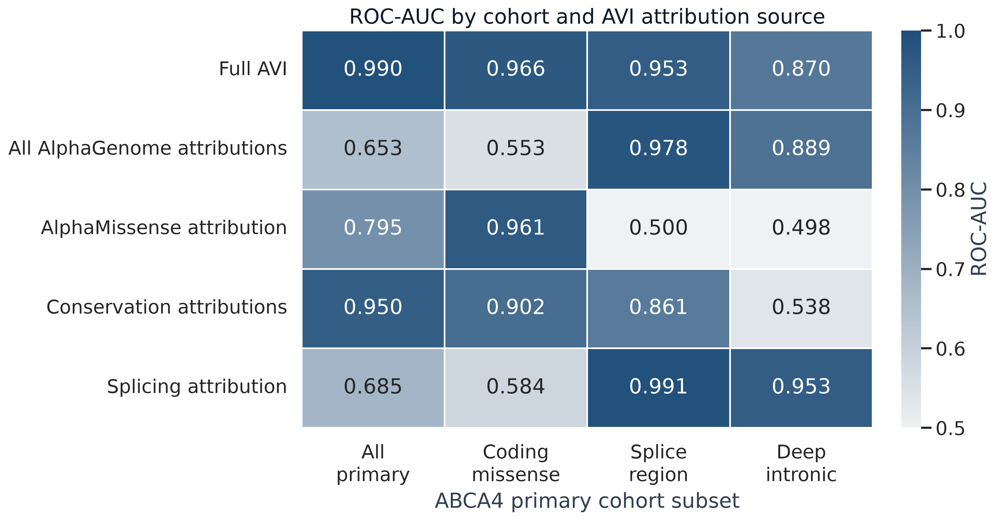
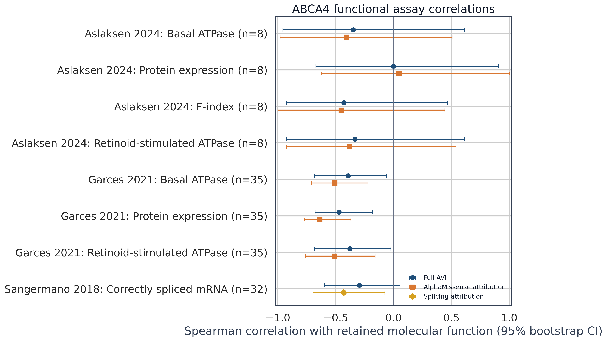
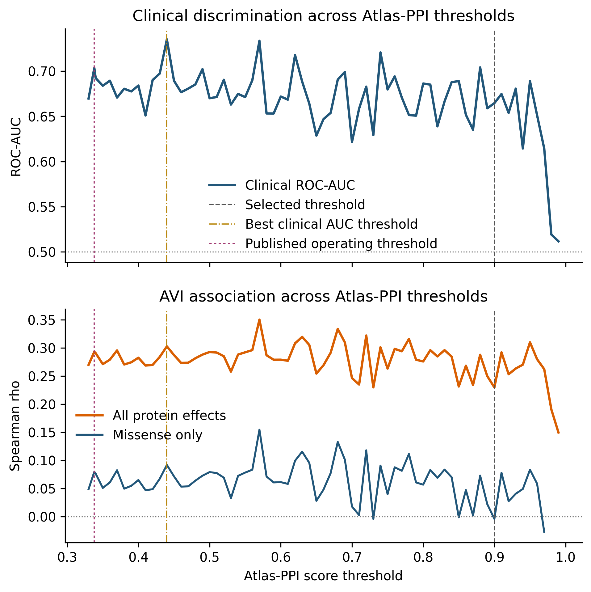
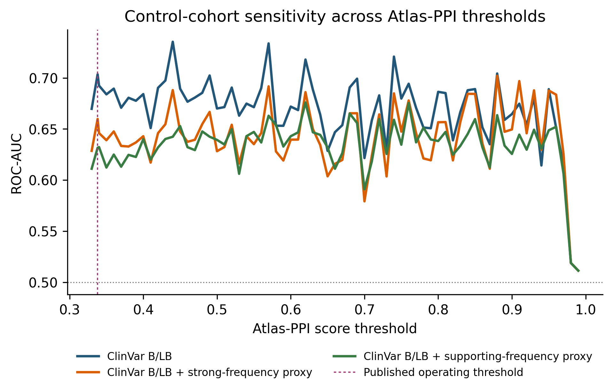

# Computational variant-effect profiling of ABCA4

This study asks whether two complementary sequence models recover known effects
of `ABCA4` variants. Google DeepMind AlphaGenome Variant Impact (AVI) scores DNA
variants and attributes predicted genomic mechanisms. Synthyra Atlas-PPI scores
how deterministic ABCA4 protein products alter a predicted human interaction
profile. ClinVar classifications and published functional assays provide the
reference evidence.

**Research use only.** These are molecular predictions and rankings, not clinical
classifications, diagnoses, or measurements of binding.

## Abstract

We retrieved 4,670 `ABCA4[gene]` ClinVar records and scored 4,024 unique,
biallelic GRCh38 SNVs. In 2,521 variants with at least one ClinVar review star,
AVI separated pathogenic or likely pathogenic (P/LP; n = 1,092) from benign or
likely benign (B/LB; n = 1,429) variants with ROC-AUC 0.990 and average precision
0.991. Mechanism-specific attributions were coherent: AlphaMissense dominated
missense ranking, while the AVI splicing attribution reached ROC-AUC 0.991 in
splice-region and 0.953 in deep-intronic cohorts. Predictions also showed modest,
directionally consistent correlations with independent protein and splicing
assays. Atlas-PPI screened 1,850 unique ABCA4 protein products against 20,659
cached human proteins. Its network-disruption score had weaker clinical
separation and little missense-specific agreement with AVI. Together, the models
support computational triage at distinct molecular levels, but not clinical use.

## Study design

| Layer | Question | Method | Evidence used here |
|---|---|---|---|
| Clinical reference | How has the variant been classified? | [NCBI ClinVar](https://www.ncbi.nlm.nih.gov/clinvar/intro/) aggregate germline classification and [review status](https://www.ncbi.nlm.nih.gov/clinvar/docs/review_status/) | P/LP versus B/LB; VUS and conflicts retained descriptively |
| Genomic effect | Does the DNA change perturb a molecular readout? | [AlphaGenome](https://www.nature.com/articles/s41586-025-10014-0) predictions summarized by the 18-feature [AVI score](https://storage.googleapis.com/deepmind-media/DeepMind.com/Blog/alphagenome-atlas-a-predictive-map-of-every-possible-dna-letter-change-in-the-human-genome/alphagenome-atlas.pdf) | Clinical discrimination, feature attribution, and assay correlation |
| Missense effect | Is an amino-acid substitution likely damaging? | [AlphaMissense](https://www.science.org/doi/10.1126/science.adg7492), included as one AVI feature | Missense attribution and protein assays |
| Protein network | Does the altered ABCA4 sequence change predicted partners? | [Atlas-PPI](https://synthyra.com/research/blog/atlas), a sequence-only dual-tower retrieval model descended from [Synteract-4](https://synthyra.com/research/blog/synteract-4) | Proteome-wide score matrix, partner changes, and enrichment |

AlphaGenome accepts 1 Mb of DNA and predicts thousands of functional-genomics
tracks, including expression, accessibility, chromatin, and splicing. AVI then
combines AlphaGenome effects with AlphaMissense, coding consequences, and
conservation into a genome-wide Phred score. Atlas-PPI instead embeds each
protein once and scores pairs by matrix multiplication, making a full proteome
screen practical after embeddings are cached. The tools answer different
questions and are not treated as interchangeable predictors.

## Results

### AVI strongly recovers retrospective ClinVar labels



**Figure 1. Clinical discrimination.** Cumulative score distributions and
ROC/precision-recall curves for precise GRCh38 SNVs. The primary cohort contains
1,092 P/LP and 1,429 B/LB variants. ROC-AUC is 0.990 (95% bootstrap CI 0.986 to
0.994), and average precision is 0.991 (0.988 to 0.994).



**Figure 2. Predicted mechanism by variant region.** Full AVI and signed feature
attributions are evaluated against the same clinical labels. AlphaMissense
accounts for most missense separation. Splicing attribution is strongest for
splice-region and deep-intronic variants. Attribution rows explain AVI behavior;
they are not retrained ablations.

### Published assays provide a smaller orthogonal check



**Figure 3. Functional-assay associations.** Study-specific Spearman
correlations compare predicted impact with retained molecular function. In 35
matched missense variants from Garces et al., AVI correlates with protein
expression and ATPase measures at rho = -0.377 to -0.470. In 32 variants from
Sangermano et al., AVI splicing attribution correlates with correctly spliced
mRNA at rho = -0.429. Negative values are mechanism-consistent because greater
predicted impact corresponds to less retained function. The Aslaksen panel has
only eight matched variants and wide intervals.

The assay sources are [Garces et al. 2021](https://doi.org/10.3390/ijms22010185),
[Sangermano et al. 2018](https://doi.org/10.1101/gr.226621.117),
[Aslaksen et al. 2024](https://doi.org/10.1167/iovs.65.10.2), and
[Wang et al. 2025](https://doi.org/10.1167/iovs.66.1.65). Assay scales remain
separate.

### Atlas-PPI adds a protein-network view, with weaker validation

The 4,024 SNVs mapped to 1,850 unique deterministic protein products after
truncation to the model's 2,044-residue capacity. Each product was embedded once
on both towers and scored against 20,659 cached human proteins. The retained
local matrix contains 38,219,150 float32 probabilities; 288,783 pairs score
strictly above 0.9.



**Figure 4. Atlas-PPI threshold sensitivity.** The sweep spans 0.33 to 0.99 and
includes the checkpoint operating point, 0.338077. At that point, network
disruption separates 736 P/LP from 27 B/LB protein products with ROC-AUC 0.704
and correlates with AVI at rho = 0.293. The missense-only correlation is 0.080.
The highest same-cohort ROC-AUC is 0.735 at 0.44 and is exploratory because the
evaluation cohort also selected the threshold.



**Figure 5. Negative-cohort sensitivity.** Only 27 independent B/LB non-WT
protein products remain after sequence deduplication. Adding gnomAD variants
that meet [ClinGen ABCA4 VCEP](https://cspec.genome.network/cspec/ui/svi/doc/GN164)
frequency criteria expands the negative sets to 31 and 67 products, but reduces
their best exploratory ROC-AUC to 0.702 and 0.676. These variants are
population-compatible proxies, not new benign classifications.

At score > 0.9, aggregate AVI and Atlas-PPI disruption correlate at rho = 0.230,
but the missense-only estimate is rho = -0.004. Differential enrichment produced
177 globally corrected pathway rows across 36 products. Early stop gains drive
the largest changes and broad olfactory/GPCR terms, so these results are treated
as extreme-sequence or model behavior until tested experimentally.

## Interpretation

The AVI result is strong retrospective prioritization, especially for
noncanonical splicing. It is not a clean prospective validation. The base
AlphaGenome model learned experimental human and mouse genome tracks rather than
ABCA4 ClinVar labels. [AVI](https://storage.googleapis.com/deepmind-media/DeepMind.com/Blog/alphagenome-atlas-a-predictive-map-of-every-possible-dna-letter-change-in-the-human-genome/alphagenome-atlas.pdf)
is a separate supervised ensemble trained on 37 million gnomAD variants using
allele frequency as a proxy, with chromosome 1 in its training partition. Public
outputs do not expose the sampled coordinates,
so direct overlap with ABCA4 variants cannot be excluded. Rarity also contributes
to clinical classification.

For Atlas-PPI, an audit of the accessible 147,861-sequence training universe
found no exact WT or mutant ABCA4 post-truncation sequence hash and no ABCA4
identifier. Pair-level training records were unavailable, so this does not rule
out influence from WT interactions, homologs, or related evidence. Atlas-PPI's
weak missense-specific result is the more relevant limitation: the screen is a
hypothesis generator for network effects, not an independent pathogenicity
classifier.

## Reproduction and data

The workflow uses Python 3.12, a locked `uv` environment, resumable NCBI and
AlphaGenome queries, allele-level GRCh38 parsing, fixed-seed 2,000-sample
bootstraps, and 300 dpi PNG output. Secrets are loaded from ignored local files
at runtime and are never written to logs or results.

```powershell
$env:UV_CACHE_DIR = "$PWD\.uv-cache"
uv sync --python 3.12 --all-groups --locked
uv run scripts/run_analysis.py all --resume
uv run scripts/make_showcase_plots.py
uv run scripts/verify_no_secret_leaks.py
```

The Atlas-PPI screen runs from the companion `synth` checkout on Modal. The
complete 1,850 by 20,659 score matrix is retained locally so thresholds can be
reanalyzed without GPU inference.

```powershell
uv run modal run scripts/core/abca4_variant_proteome_screen.py --abca4-root "C:\Users\lhall\Desktop\Research\abca4_alpha_genome" --threshold 0.9 --resume
uv run modal run scripts/core/abca4_variant_proteome_screen.py::resweep --abca4-root "C:\Users\lhall\Desktop\Research\abca4_alpha_genome" --threshold-min 0.33 --threshold-max 0.99 --threshold-step 0.01
```

Core artifacts: [methods](docs/methods.md), [data dictionary](docs/data_dictionary.md),
[reproducibility](docs/reproducibility.md), [AVI metrics](results/tables/metrics.json),
[scored variants](results/tables/variants_scored.tsv), [Atlas-PPI report](results/atlas_ppi/README.md),
[Atlas-PPI metrics](results/atlas_ppi/metrics.json), [training-overlap analysis](results/impressiveness_assessment.md),
and [benign-control audit](results/benign_control_audit.md). Every AVI score has
an AlphaGenome Atlas link. File hashes, package versions, model revision
`10be6d0b5a3559a7ad499702967c34d34980d6a0`, queries, and record counts are in
the provenance manifests.

AlphaGenome outputs are subject to the [AlphaGenome terms](https://deepmind.google/science/alphagenome/terms)
and are restricted to permitted research use. This repository does not grant
rights to third-party data or model outputs. LOVD is not scraped.
