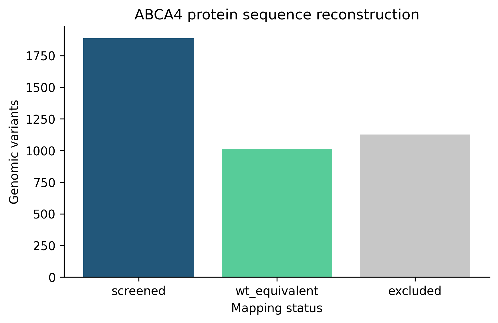
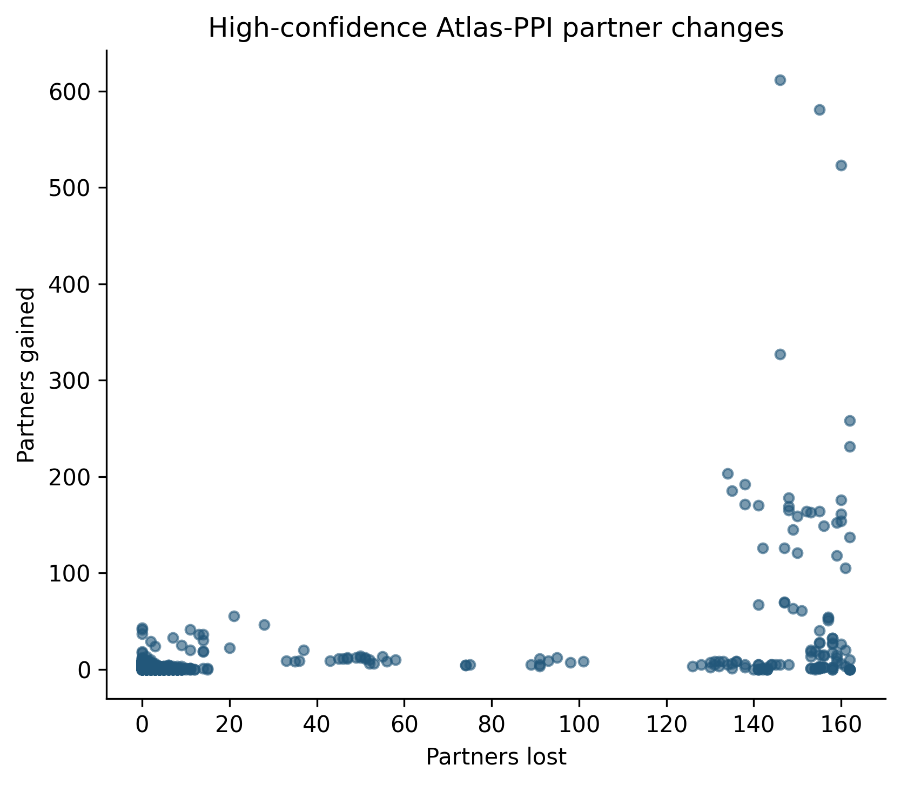
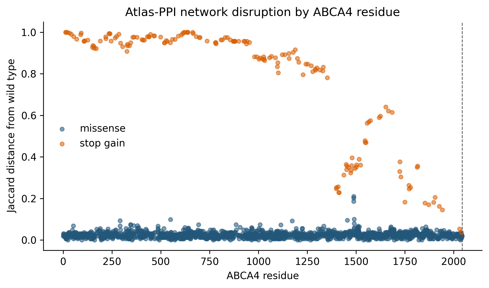
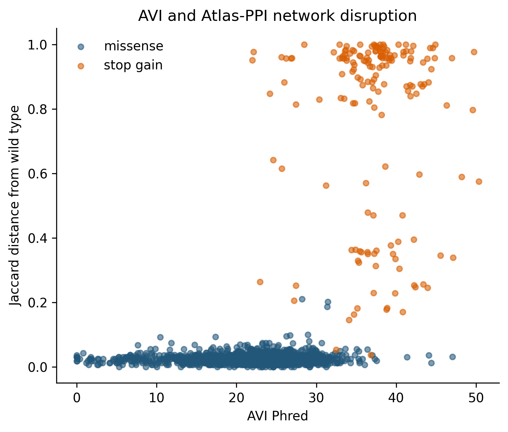
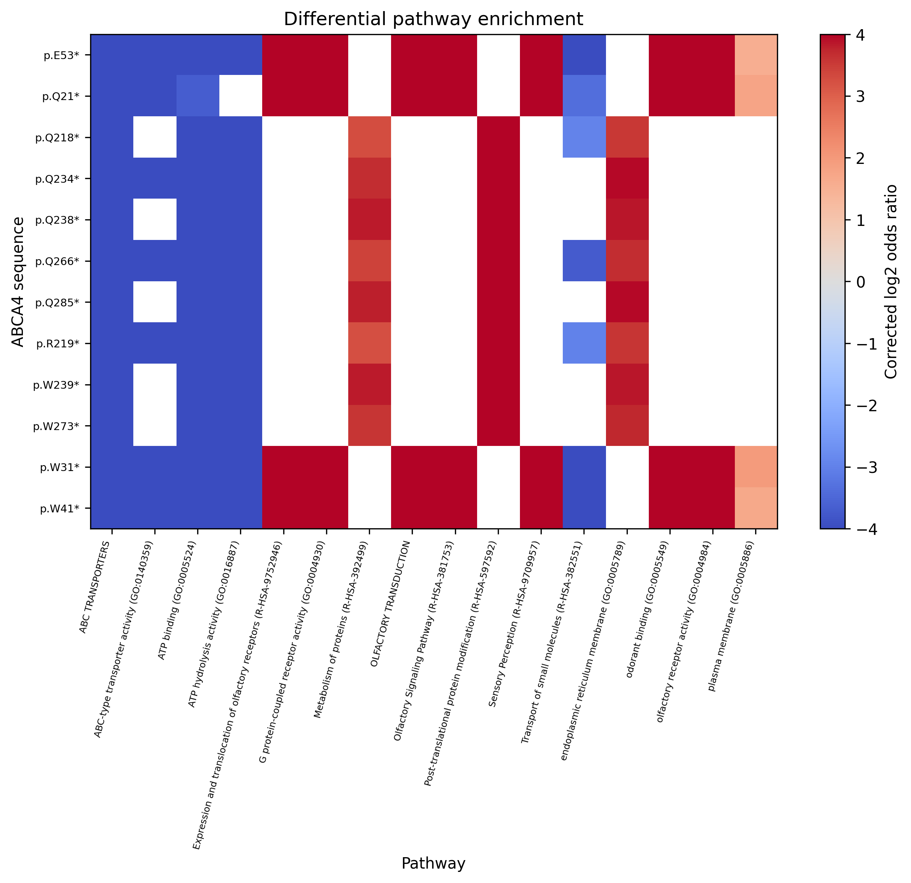
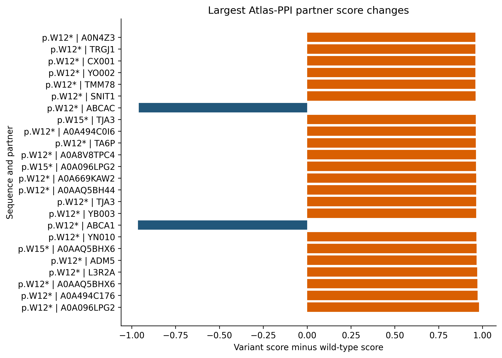
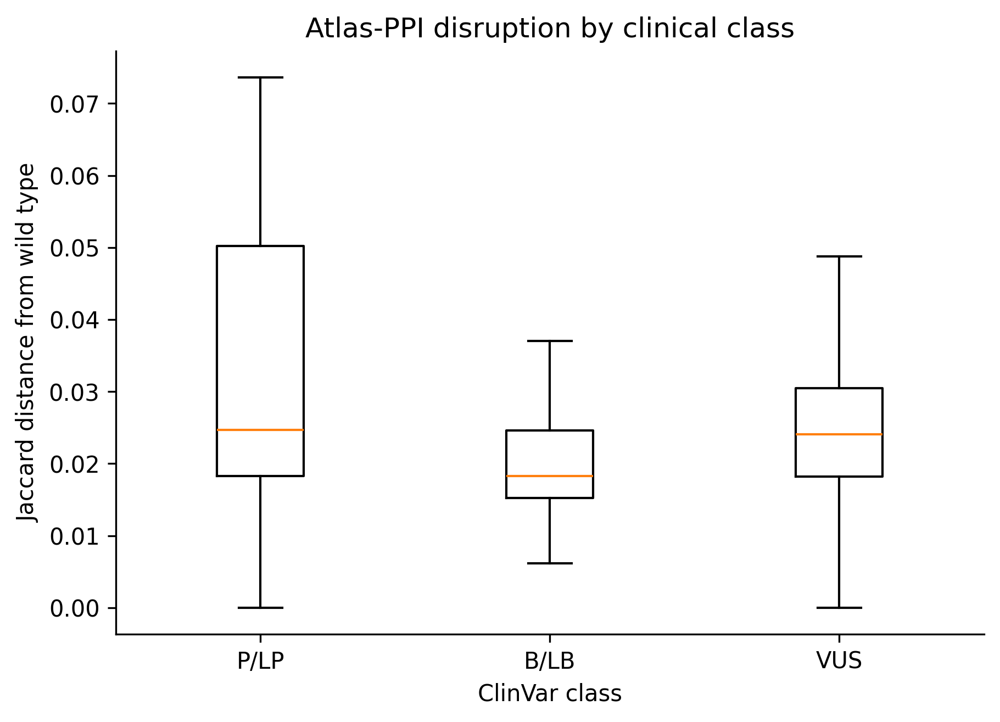

# ABCA4 Atlas-PPI cached-embedding screen

This is a research-only network-prediction experiment, not clinical evidence or a diagnostic test.

## Result

The screen evaluated 1,850 unique post-truncation ABCA4 sequences against 20,659 cached human proteins and retained 288,783 interactions with Atlas score strictly greater than 0.9.

Across non-WT unique products, AVI and Atlas-PPI network disruption had Spearman rho=0.230 (95% bootstrap CI 0.183 to 0.278; n=1,849). The missense-only estimate was rho=-0.004 across n=1,680 sequences.

Network disruption alone separated 736 P/LP from 27 B/LB unique products with ROC-AUC 0.665 (95% bootstrap CI 0.584 to 0.746). Global per-library correction retained 177 pathway changes across 36 sequences.

The complete 1,850 by 20,659 merged probability matrix is retained as float32 NumPy data (152.9 MB). Query and human index tables define its rows and columns. The matrix is a local-only artifact and is ignored by Git.

## Threshold sensitivity

The remote sweep evaluated 68 thresholds from 0.33 through 0.99. The largest same-cohort clinical ROC-AUC was 0.735 at threshold 0.44.

At the published Atlas-PPI operating threshold 0.338077128, clinical ROC-AUC was 0.704, overall AVI rho was 0.293, and missense-only AVI rho was 0.080.

This maximum is exploratory and optimistically biased because the same ClinVar cohort selected and evaluated the threshold. It should not replace the prespecified 0.9 result without independent validation or nested resampling.

The population-control sensitivity cohorts reached exploratory best ROC-AUC values of 0.702 at threshold 0.88 for the strong-frequency proxy and 0.676 at threshold 0.62 for the supporting-frequency proxy.

These are frequency-defined negative proxies, not additional clinical benign classifications. P/LP and mixed-class sequences were never relabeled.

The strongest changes are early stop-gain products. Their broad enrichment for olfactory-receptor and GPCR terms should be treated as a model or length-regime signal until experimentally validated, not as ABCA4 disease biology.

## Training-overlap audit

The pinned Atlas-PPI checkpoint used PPI training mode and not ClinVar class or AVI as a prediction target. The accessible 147,861-sequence training universe contained 0 exact post-truncation ABCA4 sequence matches. Current public artifacts do not expose the split-level interaction rows, so ABCA4 interaction-pair overlap remains not_assessable_from_current_public_artifacts.

This makes the cross-model association interesting but not a fully independent external validation. Both systems consume protein or genomic sequence, and WT ABCA4, homologs, or related interaction evidence may have influenced Atlas-PPI training.

## Ranked changes

| Rank | Protein consequence | Changed partners | Jaccard distance | Best global q |
|---:|---|---:|---:|---:|
| 1 | p.W31* | 683 | 0.997 | 3.57e-26 |
| 2 | p.W41* | 736 | 0.991 | 2.99e-22 |
| 3 | p.E53* | 758 | 0.979 | 4.02e-20 |
| 4 | p.Q21* | 393 | 1.000 | 1.84e-19 |
| 5 | p.Q234* | 336 | 0.994 | 1.19e-08 |
| 6 | p.Q285* | 311 | 0.990 | 1.99e-08 |
| 7 | p.Q238* | 314 | 0.994 | 5.46e-08 |
| 8 | p.W239* | 321 | 0.994 | 5.46e-08 |
| 9 | p.W273* | 305 | 0.981 | 3.94e-07 |
| 10 | p.Q266* | 316 | 0.972 | 4.94e-07 |

## Figures and captions



**Figure 1.** Mapping of source genomic SNVs to deterministic screened products, WT-equivalent products, and exclusions.



**Figure 2.** High-confidence partner gains and losses for each unique ABCA4 product relative to wild type.



**Figure 3.** Network-set disruption across ABCA4 residue positions. The dashed line marks the 2,044-residue Atlas input limit.



**Figure 4.** Sequence-level AVI Phred values versus Atlas-PPI partner-set Jaccard distance.



**Figure 5.** Corrected log2 odds ratios for the strongest gained-versus-lost pathway tests.



**Figure 6.** Largest individual human-partner score shifts among the most changed ABCA4 sequences.



**Figure 7.** Atlas-PPI partner-set disruption grouped by unambiguous ClinVar class at the unique-sequence level.


**Figure 8.** Clinical ROC-AUC and AVI association across the Atlas-PPI score threshold grid. Vertical lines identify the published operating threshold, the selected 0.9 cutoff, and the largest same-cohort clinical ROC-AUC.


**Figure 9.** Atlas-PPI discrimination across the original ClinVar cohort and two sensitivity cohorts that add ABCA4 VCEP frequency-compatible proxy controls. Proxy labels are not clinical benign classifications.

## Interpretation limits

Atlas-PPI predicts association-like interaction scores from protein sequence. A changed score does not establish altered binding, localization, expression, transport activity, or disease causality. Exact mutant-sequence absence from accessible training data is not proof against memorization because wild-type ABCA4, homologs, or interaction records may still have influenced training.

## Reproduce

```powershell
uv run modal run scripts/core/abca4_variant_proteome_screen.py --abca4-root "C:\Users\lhall\Desktop\Research\abca4_alpha_genome" --threshold 0.9 --resume
```

After refreshing the gnomAD audit from the ABCA4 repository, resweep the saved matrix on a CPU-only Modal worker:

```powershell
uv run modal run scripts/core/abca4_variant_proteome_screen.py::resweep --abca4-root "C:\Users\lhall\Desktop\Research\abca4_alpha_genome" --threshold-min 0.33 --threshold-max 0.99 --threshold-step 0.01
```
